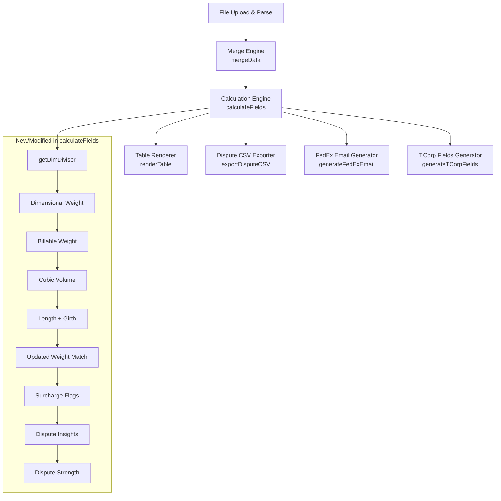

# Design Document: Dimensional Weight Calculation

## Overview

This feature extends the Veeqo Chargeback Tool's `calculateFields` engine to compute dimensional weight, billable weight, cubic volume, length+girth, carrier-specific surcharge flags, dispute insight tooltips, and a dispute strength indicator for every merged shipment row. It also updates the weight match logic to compare billable weights (instead of raw actual weights), adds new columns to the spreadsheet display, enriches the dispute CSV export, and updates the FedEx email and T.Corp templates with dimensional/billable weight data.

The core principle: carriers bill on the greater of actual weight or dimensional weight, and each carrier has specific surcharge thresholds. A package with matching actual weights can still incur significant overcharges if dimensional weights differ. This feature surfaces that critical billing data so agents can make informed dispute decisions.

### Key Design Decisions

1. **All new logic lives in `calculateFields`** — no new files are introduced. The calculation engine is the single source of truth for derived fields.
2. **Carrier lookup is a simple map** — a `getDimDivisor(carrier)` helper returns the correct divisor (139 or 166) based on carrier string, defaulting to 139.
3. **Surcharge flags are computed as arrays** — each row gets a `surchargeFlags` array of `{ name, carrierOnly }` objects, enabling both display and programmatic access.
4. **Dispute insights are computed as arrays of strings** — rule evaluation order matches the requirements (19→20→21→22→23→24→25→26).
5. **Dispute strength uses priority-ordered evaluation** — Weak conditions checked first, then Moderate, then Strong, with "Moderate" as the default fallback.
6. **No external dependencies** — all calculations are pure functions operating on the merged row object.

## Architecture

The feature modifies three layers of the existing architecture:



### Execution Order Within `calculateFields`

The calculation order matters because later fields depend on earlier ones:

1. **DIM Divisor** — looked up from carrier string
2. **Seller Dimensional Weight** — needs seller dims + divisor
3. **Carrier Dimensional Weight** — needs carrier dims + divisor
4. **Seller Billable Weight** — needs seller weight + seller dim weight
5. **Carrier Billable Weight** — needs carrier weight + carrier dim weight
6. **Cubic Volume** — needs carrier dims
7. **Length + Girth** — needs carrier dims
8. **Weight Match** (updated) — now uses billable weights instead of raw weights
9. **Dims Match** — unchanged
10. **Status** — unchanged (still derived from weight match + dims match)
11. **Chargeback Amount** — unchanged
12. **Surcharge Flags** — needs billable weight, cubic volume, length+girth, carrier dims, carrier, service name; computed for both seller and carrier dims to determine "carrier only" annotation
13. **Dispute Insights** — needs status, surcharge flags, dim weights, chargeback amount, individual dim differences
14. **Dispute Strength** — needs status, surcharge flags, billable weights, chargeback amount, individual dim differences

## Components and Interfaces

### 1. `getDimDivisor(carrier: string): number`

New pure helper function.

| Carrier | Divisor |
|---------|---------|
| UPS     | 139     |
| FEDEX   | 139     |
| DHL     | 139     |
| USPS    | 166     |
| default | 139     |

Carrier string is compared case-insensitively (already uppercased by `mapTaskEngineRow`).

### 2. `computeSurchargeFlags(carrier, dims, weight, billableWeight, cubicVolume, lengthPlusGirth, serviceName): string[]`

New pure helper that returns an array of surcharge flag names triggered by the given measurements. Called twice per row: once with carrier-audited values, once with seller values. The caller compares results to determine "carrier only" annotations.

**Parameters:**
- `carrier` — uppercase carrier string
- `dims` — `[length, width, height]` sorted descending (longest first)
- `weight` — actual weight in lbs
- `billableWeight` — billable weight in lbs
- `cubicVolume` — cubic inches
- `lengthPlusGirth` — inches
- `serviceName` — service name string (for FedEx One Rate check)

**Returns:** Array of flag name strings (e.g., `['AHS-Weight', 'AHS-Dimension']`)

### 3. Extended `calculateFields(row): row`

Modified to compute all new fields and attach them to the row object. New fields added to each row:

| Field | Type | Description |
|-------|------|-------------|
| `sellerDimWeight` | `number \| 'N/A'` | Seller dimensional weight (lbs) |
| `carrierDimWeight` | `number \| 'N/A'` | Carrier dimensional weight (lbs) |
| `sellerBillableWeight` | `number \| 'N/A'` | max(seller weight, seller dim weight) |
| `carrierBillableWeight` | `number \| 'N/A'` | max(carrier weight, carrier dim weight) |
| `cubicVolume` | `number \| 'N/A'` | L × W × H cubic inches |
| `lengthPlusGirth` | `number \| 'N/A'` | L + 2W + 2H inches |
| `surchargeFlags` | `Array<{name: string, carrierOnly: boolean}>` | Triggered surcharge flags |
| `disputeInsights` | `string[]` | Generated insight messages |
| `disputeStrength` | `'Strong' \| 'Moderate' \| 'Weak'` | Dispute strength classification |

### 4. Updated `COLUMNS` Array

Six new data columns inserted after the existing dimension/weight columns, plus a Surcharge Flags column, an Insights column, and a Dispute Strength column (positioned as second column after checkbox).

### 5. Updated `renderTable(rows)`

- Renders Dispute Strength badge as second column (green/amber/red)
- Renders surcharge flags with red text for "carrier only", grey for shared
- Renders info icon for insights with tooltip on hover/click
- Renders dispute strength summary counts above the table
- Supports sorting by Dispute Strength column

### 6. Updated `exportDisputeCSV(rows, tabName)`

Adds two new columns: `Seller Billable Weight (lbs)` and `Carrier Billable Weight (lbs)`.

### 7. Updated `generateFedExEmail(rows, agentName)`

Seller line format: `Seller: {L} x {W} x {H} in, {weight} lbs (dim weight: {sellerDimWeight} lbs, billable: {sellerBillableWeight} lbs)`
Carrier line format: `Carrier Audit: {L} x {W} x {H} in, {weight} lbs (dim weight: {carrierDimWeight} lbs, billable: {carrierBillableWeight} lbs)`

### 8. Updated `generateTCorpFields(rows)`

Per-shipment breakdown format:
- Seller: `{L}x{W}x{H} {weight}lbs (dim: {sellerDimWeight}lbs, billable: {sellerBillableWeight}lbs)`
- Carrier: `{L}x{W}x{H} {weight}lbs (dim: {carrierDimWeight}lbs, billable: {carrierBillableWeight}lbs)`

## Data Models

### Merged Row Object (Extended)

The existing merged row object gains these new properties after `calculateFields` runs:

```javascript
{
  // ... existing fields (trackingNumber, shipmentId, carrier, sellerWeight, etc.) ...

  // New calculated fields
  sellerDimWeight: number | 'N/A',       // (L×W×H) / divisor, rounded to 2dp
  carrierDimWeight: number | 'N/A',      // (L×W×H) / divisor, rounded to 2dp
  sellerBillableWeight: number | 'N/A',  // max(sellerWeight, sellerDimWeight)
  carrierBillableWeight: number | 'N/A', // max(carrierAuditedWeight, carrierDimWeight)
  cubicVolume: number | 'N/A',           // carrier L×W×H
  lengthPlusGirth: number | 'N/A',       // longest + 2×second + 2×third (carrier dims)

  // Surcharge flags
  surchargeFlags: [
    { name: 'AHS-Weight', carrierOnly: true },
    { name: 'Oversize', carrierOnly: false },
    // ...
  ],

  // Dispute insights (ordered list of plain-English messages)
  disputeInsights: [
    "Small dimension difference detected. Carriers round up...",
    "The carrier's measurements pushed this package into AHS-Weight territory..."
  ],

  // Dispute strength
  disputeStrength: 'Strong' | 'Moderate' | 'Weak'
}
```

### Surcharge Threshold Constants

```javascript
const SURCHARGE_THRESHOLDS = {
  FEDEX: {
    AHS_WEIGHT: { billableWeight: 50 },
    AHS_DIMENSION: { longestSide: 48, secondLongest: 30 },
    AHS_CUBIC: { cubicVolume: 10368 },
    OVERSIZE: { longestSide: 96, lengthPlusGirth: 130, cubicVolume: 17280 },
    OVER_MAX: { actualWeight: 150, longestSide: 108, lengthPlusGirth: 165 },
    ONE_RATE: { cubicVolume: 2200, actualWeight: 50 }
  },
  UPS: {
    AHS_WEIGHT: { billableWeight: 50 },
    AHS_DIMENSION: { longestSide: 48, secondLongest: 30 },
    AHS_CUBIC: { cubicVolume: 10368 },
    LARGE_PACKAGE: { longestSide: 96, lengthPlusGirth: 130, cubicVolume: 17280, actualWeight: 110 },
    OVER_MAX: { actualWeight: 150, longestSide: 108, lengthPlusGirth: 165 }
  },
  USPS: {
    NON_STANDARD_SMALL: { longestSideMin: 22, longestSideMax: 30 },
    NON_STANDARD_LARGE: { longestSide: 30 },
    VOLUME_SURCHARGE: { cubicVolume: 3456 },
    BALLOON_PRICING: { lengthPlusGirthMin: 84, lengthPlusGirthMax: 108, actualWeightMax: 20 },
    OVER_MAX: { actualWeight: 70, lengthPlusGirth: 130 }
  },
  DHL: {
    AHS_WEIGHT: { billableWeight: 50 },
    AHS_DIMENSION: { longestSide: 48 }
  }
};
```

### Dispute Strength Evaluation Order

```
1. CHECK WEAK conditions (first match wins):
   W1: status === 'Match' AND no surcharge flag differences
   W2: 'Over Max' flag triggered by carrier
   W3: chargebackAmount <= 0
   W4: seller and carrier trigger same flags AND all dim diffs ≤ 1 inch

2. CHECK MODERATE conditions (first match wins):
   M1: all dim diffs ≤ 2 inches AND billable weight diff > 5 lbs
   M2: carrier-only surcharge AND seller dims within 10% of threshold
   M3: chargebackAmount < 5.00
   M4: 'One Rate Exceeded' flag triggered

3. CHECK STRONG conditions (first match wins):
   S1: any dim diff > 2 inches AND carrier-only surcharge flag
   S2: billable weight diff > 10 lbs AND seller triggers no surcharge flags
   S3: chargebackAmount > 5.00 AND status === 'Mismatch' AND no shared surcharge flags

4. DEFAULT: 'Moderate'
```

### COLUMNS Array (Updated)

The `COLUMNS` array is extended with these entries inserted at appropriate positions:

```javascript
// After existing seller dimension columns:
{ key: 'sellerDimWeight', label: 'Seller Dim Weight (lbs)', monetary: false },
{ key: 'sellerBillableWeight', label: 'Seller Billable Weight (lbs)', monetary: false },

// After existing carrier dimension columns:
{ key: 'carrierDimWeight', label: 'Carrier Dim Weight (lbs)', monetary: false },
{ key: 'carrierBillableWeight', label: 'Carrier Billable Weight (lbs)', monetary: false },

// After carrier weight columns:
{ key: 'cubicVolume', label: 'Cubic Volume (in³)', monetary: false },
{ key: 'lengthPlusGirth', label: 'Length + Girth (in)', monetary: false },

// After status column:
{ key: 'surchargeFlags', label: 'Surcharge Flags', monetary: false },
{ key: 'disputeInsights', label: 'Insights', monetary: false },

// Second column (after checkbox):
// Dispute Strength is rendered specially, not via COLUMNS — it's inserted as the first visible column
```


## Correctness Properties

*A property is a characteristic or behavior that should hold true across all valid executions of a system — essentially, a formal statement about what the system should do. Properties serve as the bridge between human-readable specifications and machine-verifiable correctness guarantees.*

### Property 1: Dimensional Weight Formula

*For any* three non-negative numeric dimensions (L, W, H) and any carrier string, the computed dimensional weight SHALL equal `Math.round((L × W × H) / getDimDivisor(carrier) * 100) / 100`. This applies to both seller and carrier dimensional weight calculations identically.

**Validates: Requirements 2.1, 3.1**

### Property 2: N/A Propagation for Dimensional Weight

*For any* row where at least one of the three dimension values is `'N/A'`, the corresponding dimensional weight (seller or carrier) SHALL be `'N/A'`.

**Validates: Requirements 2.2, 3.2**

### Property 3: Billable Weight is Max of Actual and Dimensional

*For any* numeric actual weight and numeric dimensional weight, the billable weight SHALL equal `Math.max(actualWeight, dimensionalWeight)`. This applies to both seller billable weight and carrier billable weight identically.

**Validates: Requirements 4.1, 5.1**

### Property 4: N/A Propagation for Derived Weight Fields

*For any* row where either the actual weight or the dimensional weight is `'N/A'`, the corresponding billable weight SHALL be `'N/A'`. Furthermore, when either billable weight is `'N/A'`, the weight match SHALL be `'N/A'`.

**Validates: Requirements 4.2, 4.3, 4.4, 5.2, 5.3, 5.4, 8.3**

### Property 5: Cubic Volume Formula

*For any* three non-negative numeric carrier-audited dimensions (L, W, H), the cubic volume SHALL equal `L × W × H`. When any carrier dimension is `'N/A'`, cubic volume SHALL be `'N/A'`.

**Validates: Requirements 6.1, 6.2**

### Property 6: Length Plus Girth Formula

*For any* three non-negative numeric carrier-audited dimensions, the length plus girth SHALL equal `longest + (2 × second) + (2 × third)` where the dimensions are sorted in descending order. When any carrier dimension is `'N/A'`, length plus girth SHALL be `'N/A'`.

**Validates: Requirements 7.1, 7.2**

### Property 7: Weight Match Uses Billable Weights with 0.5 lb Tolerance

*For any* two numeric billable weights (seller and carrier), weight match SHALL be `'Yes'` if and only if the absolute difference is less than or equal to 0.5 lbs, and `'No'` otherwise.

**Validates: Requirements 8.1, 8.2**

### Property 8: Surcharge Flag Threshold Correctness

*For any* row with a recognized carrier and numeric dimensions/weights, the set of surcharge flag names returned by `computeSurchargeFlags` SHALL exactly match the set predicted by applying all carrier-specific threshold rules (FedEx: AHS-Weight, AHS-Dimension, AHS-Cubic, Oversize, Over Max, One Rate Exceeded; UPS: AHS-Weight, AHS-Dimension, AHS-Cubic, Large Package, Over Max; USPS: Non-Standard small/large, Volume Surcharge, Balloon Pricing, Over Max; DHL: AHS-Weight, AHS-Dimension).

**Validates: Requirements 13.1, 13.2, 13.3, 13.4, 13.5, 13.6, 14.1, 14.2, 14.3, 14.4, 14.5, 15.1, 15.2, 15.3, 15.4, 15.5, 16.1, 16.2**

### Property 9: Surcharge Flag Carrier-Only Annotation

*For any* surcharge flag in a row's `surchargeFlags` array, the `carrierOnly` field SHALL be `true` if and only if `computeSurchargeFlags` applied to carrier-audited measurements includes that flag AND `computeSurchargeFlags` applied to seller measurements does not include that flag.

**Validates: Requirements 17.1, 17.2, 17.3**

### Property 10: Dispute Insight Rule Completeness

*For any* row, the generated `disputeInsights` array SHALL contain exactly the set of insight messages produced by evaluating all seven insight rules (match-no-flag-diff, small-dim-diff, significant-dim-weight-diff, carrier-only-surcharge, both-triggered-surcharge, small-chargeback, over-max, one-rate-exceeded) against the row's computed fields, with no extra or missing messages.

**Validates: Requirements 19.1, 20.1, 21.1, 22.1, 23.1, 24.1, 25.1, 26.1**

### Property 11: Dispute Strength Priority-Ordered Classification

*For any* row, the `disputeStrength` SHALL be determined by evaluating conditions in strict priority order: Weak conditions first (W1–W4), then Moderate conditions (M1–M4), then Strong conditions (S1–S3), with the first matching condition determining the classification. If no condition matches, the classification SHALL default to `'Moderate'`.

**Validates: Requirements 28.1, 28.2, 28.3, 28.4, 28.5, 29.1, 29.2, 29.3, 29.4, 29.5, 30.1, 30.2, 30.3, 30.4, 31.1**

### Property 12: Dispute CSV Includes Billable Weights

*For any* set of selected rows, the dispute CSV output SHALL contain `Seller Billable Weight (lbs)` and `Carrier Billable Weight (lbs)` columns with the correct values for each row.

**Validates: Requirements 10.1, 10.2**

### Property 13: FedEx Email Template Format

*For any* row with numeric dimensions and weights, the FedEx email seller line SHALL match the format `Seller: {L} x {W} x {H} in, {weight} lbs (dim weight: {sellerDimWeight} lbs, billable: {sellerBillableWeight} lbs)` and the carrier line SHALL match `Carrier Audit: {L} x {W} x {H} in, {weight} lbs (dim weight: {carrierDimWeight} lbs, billable: {carrierBillableWeight} lbs)`. When any dim/billable weight is `'N/A'`, the corresponding position SHALL display `'N/A'`.

**Validates: Requirements 11.1, 11.2, 11.3, 11.4**

### Property 14: T.Corp Template Format

*For any* row with numeric dimensions and weights, the T.Corp per-shipment seller portion SHALL match `Seller: {L}x{W}x{H} {weight}lbs (dim: {sellerDimWeight}lbs, billable: {sellerBillableWeight}lbs)` and the carrier portion SHALL match `Carrier: {L}x{W}x{H} {weight}lbs (dim: {carrierDimWeight}lbs, billable: {carrierBillableWeight}lbs)`. When any dim/billable weight is `'N/A'`, the corresponding position SHALL display `'N/A'`.

**Validates: Requirements 12.1, 12.2, 12.3, 12.4**

## Error Handling

### N/A Propagation Strategy

All new computed fields follow a consistent N/A propagation rule: if any input to a calculation is `'N/A'`, the output is `'N/A'`. This prevents nonsensical partial calculations and ensures the UI clearly shows when data is missing.

| Scenario | Behavior |
|----------|----------|
| Missing seller dimensions | sellerDimWeight, sellerBillableWeight → `'N/A'` |
| Missing carrier dimensions | carrierDimWeight, carrierBillableWeight, cubicVolume, lengthPlusGirth → `'N/A'` |
| Missing any billable weight | weightMatch → `'N/A'` |
| Unrecognized carrier | DIM divisor defaults to 139; surcharge flags return empty array |
| All dimensions zero | Dimensional weight = 0.00 (valid computation, not an error) |
| Negative chargeback amount | Treated as valid (can occur when seller rate > carrier rate); triggers Weak dispute strength |

### Surcharge Flag Edge Cases

- When carrier dimensions are `'N/A'`, no surcharge flags are computed (empty array).
- When seller dimensions are `'N/A'`, all carrier-triggered flags are annotated as `carrierOnly: true` (since seller can't trigger any flags).
- The `computeSurchargeFlags` function handles the case where dimensions are `'N/A'` by returning an empty array early.

### Dispute Strength Edge Cases

- Unmatched rows (no carrier data) get `disputeStrength: 'Moderate'` by default since no conditions can be evaluated.
- Rows with `chargebackAmount === 'N/A'` skip chargeback-amount-based conditions and fall through to other rules or the default.

## Testing Strategy

### Property-Based Testing

This feature is well-suited for property-based testing because:
- The core logic consists of pure functions with clear input/output behavior
- The input space is large (arbitrary numeric dimensions, weights, carrier strings)
- Universal properties hold across all valid inputs (formulas, threshold comparisons, N/A propagation)
- Edge cases around thresholds are best discovered through randomized input generation

**Library:** [fast-check](https://github.com/dubzzz/fast-check) (JavaScript property-based testing library)

**Configuration:**
- Minimum 100 iterations per property test
- Each property test tagged with: `Feature: dimensional-weight-calculation, Property {N}: {title}`

**Property tests to implement (one test per correctness property):**

| Property | Test Description |
|----------|-----------------|
| 1 | Generate random (L, W, H, carrier) tuples; verify dim weight formula |
| 2 | Generate rows with random N/A placement in dims; verify N/A output |
| 3 | Generate random (actualWeight, dimWeight) pairs; verify max selection |
| 4 | Generate rows with N/A in weight fields; verify N/A cascades |
| 5 | Generate random (L, W, H) tuples; verify cubic volume = L×W×H |
| 6 | Generate random (L, W, H) tuples; verify L+G formula with sorting |
| 7 | Generate random billable weight pairs; verify 0.5 lb tolerance |
| 8 | Generate random rows per carrier; verify surcharge flag set matches threshold rules |
| 9 | Generate random rows with both seller and carrier dims; verify carrierOnly annotation |
| 10 | Generate random rows; verify insight array matches rule evaluation |
| 11 | Generate random rows; verify dispute strength matches priority-ordered evaluation |
| 12 | Generate random rows; verify CSV output contains billable weight columns |
| 13 | Generate random rows; verify FedEx email format |
| 14 | Generate random rows; verify T.Corp format |

### Unit Tests (Example-Based)

Unit tests complement property tests for specific scenarios:

- **DIM divisor lookup:** Verify exact values for UPS, FedEx, DHL, USPS, and unknown carriers (Req 1.1–1.5)
- **Zero dimensions:** Verify dim weight = 0.00 when all dims are zero (Req 2.3, 3.3)
- **Column presence:** Verify COLUMNS array contains all new entries at correct positions (Req 9.1–9.7)
- **UI rendering:** Verify renderTable produces correct HTML for surcharge flags (red/grey), insight icons, and dispute strength badges (Req 18.1–18.4, 27.1–27.4, 32.1–32.5)
- **Summary counts:** Verify summary line shows correct Strong/Moderate/Weak counts (Req 33.1–33.3)
- **Evaluation order:** Verify Weak takes precedence over Moderate, Moderate over Strong (Req 28.5, 29.5, 30.4)
